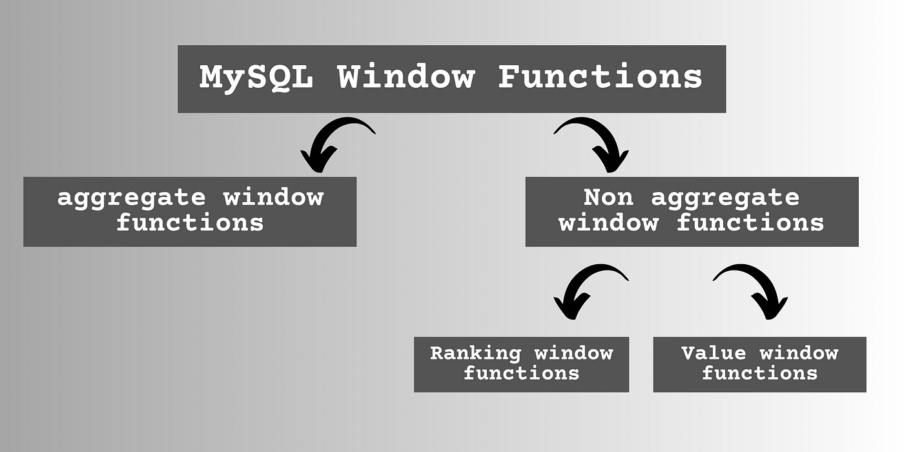
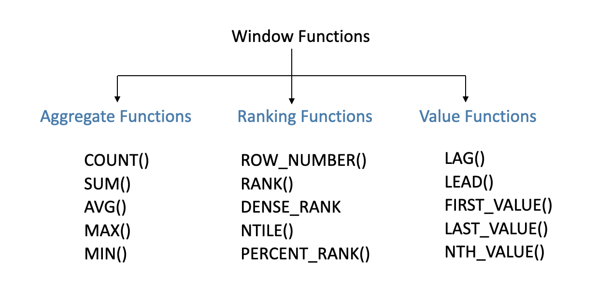

# Topic : Advanced Aggregation Functions in SQL

---

As usual, we were divided into groups of 6 to discuss on advanced aggregation functions; rank, windowing, pivoting and rollup and cube.

I have maintained notes for all topics myself which i will share below.

## Ranking

Finding the position of a value within a set is a common operation.

Ranking is done with an order by specification. The following query gives the rank of each student:
       
       select ID, rank() over (order by (GPA) desc) as s rank
       from student grades;

Note that the order of tuples in the output is not defined, so they may not be sorted by rank. An extra order by clause is needed to get them in sorted order, as follows:

       select ID, rank () over (order by (GPA) desc) as s rank
       from student grades
       order by s rank;

A basic issue with ranking is how to deal with the case of multiple tuples that are the same on the ordering attributes. In my example, this means deciding what to do if there are two students with the same GPA. The rank function gives the same rank to all tuples that are equal on the order by attributes. For instance, if the highest GPA is shared by two students, both would get rank 1. The next rank given would be 3, not 2, so if three students get the next highest GPA, they would all get rank 3, and the next student would get rank 6, and so on.

## Windowing

Perform calculations across a set of rows related to the current row within a query result set.

Window queries compute an aggregate function over ranges of tuples. This is useful, for example, to compute an aggregate of a fixed range of time; the time range is called a window. Windows may overlap, in which case a tuple may contribute to more than one window. This is unlike the partitions we saw earlier, where a tuple could contribute to only one partition.

Window functions are typically used with the OVER clause, which defines the window frame within which the function operates. The PARTITION BY clause divides the result set into partitions to which the window function is applied separately, while the ORDER BY clause specifies the order of rows within each partition.

An example of the use of windowing is trend analysis. 

Some examples of windowing can be sales trend analysis, stock-market trend analysis etc.

- Aggregate functons

compute a single result from a set of input values.

Example usage of SUM:

     SELECT 
         department,
         employee_name,
         salary,
         SUM(salary) OVER (PARTITION BY department) AS department_total_salary
     FROM employees;

SUM(salary) OVER (PARTITION BY department) calculates the sum of salaries within each department.

- Ranking functions

assign a rank to each row based on some criteria.

Example usage of RANK:

     SELECT 
         employee_name,
         salary,
         RANK() OVER (ORDER BY salary DESC) AS salary_rank
     FROM employees;

This assigns a rank to each employee based on their salary, ordered from highest to lowest.

- Value functions

return a value based on the position of the current row within the window.

Example usage of LEAD:

     SELECT 
         employee_name,
         salary,
         LEAD(salary) OVER (ORDER BY salary DESC) AS next_highest_salary
     FROM employees;

This returns the salary of the employee with the next highest salary compared to the current row.

## Pivoting

Technique used to rotate rows into columns to create a summary of data. 

It involves transforming data from rows into columns to achieve a more concise representation of information. In SQL, we can pivot data using aggregate functions combined with conditional logic like CASE statements.

     SELECT
         category,
         SUM(CASE WHEN month = 'January' THEN sales END) AS January,
         SUM(CASE WHEN month = 'February' THEN sales END) AS February,
         SUM(CASE WHEN month = 'March' THEN sales END) AS March
     FROM
         sales_data
     GROUP BY
         category;
 
## Rollup and Cube

Rollup and Cube are extensions of the Group By clause that enable the generation of multiple grouping sets within a single query.

### Rollup

Generates subtotals for a hierarchy of values within the grouped data. 

It produces subtotals starting from the most detailed level of grouping, going up to the grand total.

     SELECT 
         category, 
         product, 
         SUM(sales) AS total_sales
     FROM 
         sales_data
     GROUP BY 
         ROLLUP(category, product);

### Cube

generates subtotals for all possible combinations of columns in the Group By clause, producing a summary across multiple dimensions.

     SELECT 
         category, 
         product, 
         SUM(sales) AS total_sales
     FROM 
         sales_data
     GROUP BY 
         CUBE(category, product);

# Conclusion

SQL queries can be invoked from host languages via embedded and dynamic SQL.  Some queries, such as transitive closure, can be expressed either by using iteration or by using recursive SQL queries. Recursion can be expressed using either recursive views or recursive with clause definitions.

SQL supports several advanced aggregation features, including ranking and windowing queries, as well as pivot, and rollup/cube operations. These simplify the expression of some aggregates and allow more efficient evaluation.