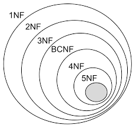

---
Title: DBS101 Flipped Class 5
categories: [DBS101, Flipped_Class]
tags: [DBS101]
---

# Topic : Understanding Normal Forms in Database Systems
---

## Normal Forms 

Normal bureaucracy outline conditions over facts dependencies or semantic constraints distinct as part of a database schema. These conditions are used to assess whether or not a database design possesses suited properties, together with the absence of redundant records. 

If a database does no longer meet these situations, normalization may be implemented to transform it right into a properly-designed equivalent. The technique of normalization includes organizing records into tables to lessen redundancy and improve statistics integrity 2.

### What i did

As always, after getting into our respective groups to discuss we start discussing soon. Since the lesson was covered earlier by the tutor, it was easier to understand and the session went smoothly.

I've collected some notes for each normal form which are brief and thorough

**The First Normal Form (1NF)**

The First Normal Form (1NF) is the foundational level of normalization. A desk is in 1NF if it meets the following standards:

* Each cellular consists of best a unmarried cost (atomicity).
* There is a number one key for identification.
* There aren't any duplicated rows or columns.
* Each column contains handiest one cost for every row in the table 5.

**The Second Normal Form (2NF)**

Building upon 1NF, the Second Normal Form (2NF) calls for a desk to be in 1NF and to haven't any partial dependencies. 

This means that all non-key attributes ought to be completely depending on the primary key. This form removes redundancy by making sure that every piece of records is stored in best one region five.

**The Third Normal Form (3NF)**

The Third Normal Form (3NF) extends 2NF by getting rid of transitive partial dependencies. This way that a non-top characteristic (an attribute no longer a part of the primary key) need to now not depend on another non-top attribute. By adhering to 3NF, a database layout similarly reduces redundancy and improves information integrity five.

#### Beyond 3NF

While 3NF is the most normally used normal form, there are extra bureaucracy which include 4NF, 5NF, and even 6NF. 

**Fourth Normal Form (4NF)**

The Fourth Normal Form (4NF) is a stage of database normalization that builds upon the primary 3 ordinary forms (1NF, 2NF, and 3NF) and the Boyce-Codd Normal Form (BCNF). 

It addresses the issue of non-trivial multivalued dependencies, which occur when the presence of one or extra rows in a desk implies the presence of one or more different rows in that equal desk. 

For a table to be in 4NF, it ought to meet the requirements of BCNF and no longer contain a couple of multivalued dependency. This form is crucial for doing away with redundancy and ensuring information integrity through making sure that each piece of statistics is stored in only one region 15.

**Fifth Normal Form (5NF)**

The Fifth Normal Form (5NF), also called Project-Join Normal Form (PJNF), is the very best level of normalization. It offers with join dependencies, which can be beyond the scope of 4NF. Achieving 5NF generally entails in addition decomposition and is frequently essential for complicated databases. 

While 4NF focuses on eliminating multivalued dependencies, 5NF addresses cases where a desk is in 4NF but there are be part of dependencies that may be further optimized. 

This shape is mainly useful in situations wherein a table is in 4NF, however there are nonetheless redundancies that may be eliminated by means of decomposing the table into smaller tables 15.

These higher regular bureaucracy address extra complex dependencies and redundancies, offering further refinement of database layout. However, maximum databases do no longer exceed 3NF, as it strikes a balance among decreasing redundancy and keeping practicality five.

# Conclusion

Normalization and regular bureaucracy are essential for developing efficient, reliable, and maintainable database structures. 

By organizing information according to those rules, database directors can make sure that data is saved in a manner that minimizes redundancy and maximizes information integrity. While 3NF is the maximum widely used everyday form, understanding and making use of better ordinary forms can in addition optimize database designs for unique use cases.

**References**

Arenas, M. (2009). Normal Forms and Normalization. In: LIU, L., ÖZSU, M.T. (eds) Encyclopedia of Database Systems. Springer, Boston, MA. Https://doi.Org/10.1007/978-zero-387-39940-9_1237

Kolade Chris. (n.D.). Database Normalization – Normal Forms 1nf 2nf 3nf Table Examples. FreeCodeCamp. Retrieved from https://www.Freecodecamp.Org/news/database-normalization-1nf-2nf-3nf-table-examples/