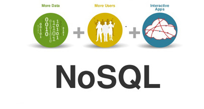
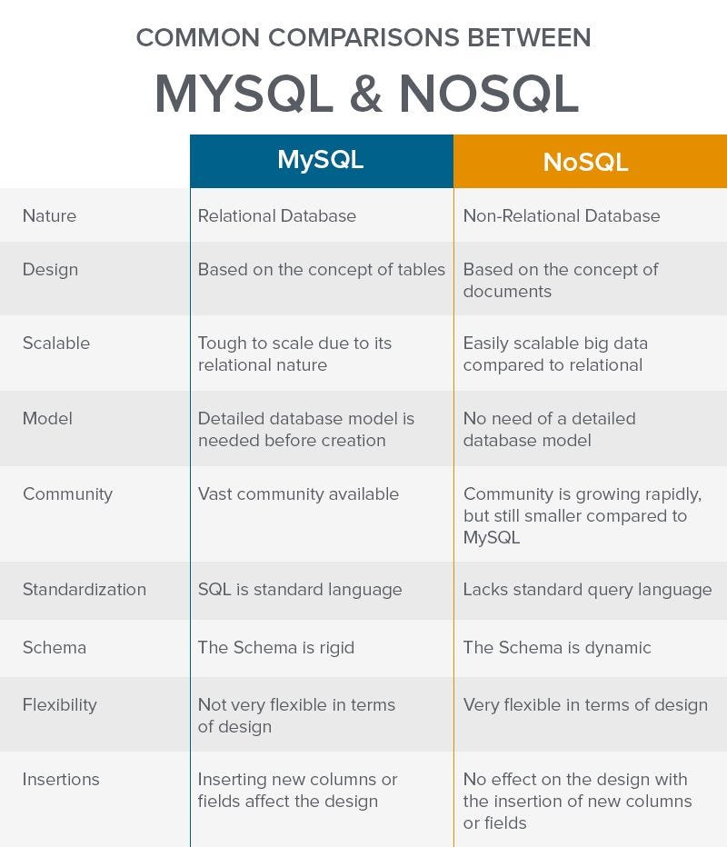

# Topic : Journal Entry: Exploring NoSQL Database Types

## NoSQL Databases

NoSQL databases have emerged as a compelling alternative to traditional SQL databases, imparting flexibility, scalability, and performance blessings for specific use instances. 

This entry delves into the numerous types of NoSQL databases, along with Document-based, Key-Value, Graph, Vector, Time-collection, and Column-orientated databases, highlighting their unique functions, use cases, and benefits.

## Research

**What could differ NoSQL from SQL?**

### What i did
Since this concept was really important, our tutor reminded us to be serious about it and the arrangements were made in such a way every student in their home groups had different topics.

There was pressure but it made each one of us responsible for one's team performance at the Q&A session later onwards.

These are all the collected notes from myself and the rest of my team mates.

### Types of NoSQL Database

**Document-based totally Databases**

* Document-based databases, additionally called report shops, save facts in the form of documents, typically in codecs like JSON, BSON, XML, or YAML. 

* These databases are ***schema-less***, taking into account bendy records structures and clean integration of semi-established and unstructured records. 

* They are relatively scalable and assist complicated facts models, making them best for packages requiring dynamic and bendy information storage. 

* Examples are MongoDB and CouchDB 

**Key-Value Databases**

* Key-price databases are the **most effective** form of NoSQL databases, characterised with the aid of their simplicity and scalability. 

* They save records as a set of key-value pairs, in which each secret is unique and maps to a fee. 

* This model gives excessive overall performance and ***flexibility***, as it does not require a predefined schema. 

* Key-price databases are particularly appropriate for caching, consultation control, and storing easy facts structures. An example is redis.

**Graph Databases**

* Graph databases use a ***graphical*** illustration to manage data, including nodes (entities) and edges (relationships). 

* They are designed to effectively keep and query interconnected facts, making them perfect for applications that require complex relationships, such as social networks and recommendation engines. Graph databases permit for green traversal of relationships and can carry out complicated queries with minimum latency.

* Examples are like Neo4j and OrientDB.

**Vector Databases**

* Vector databases are not explicitly stated in the provided resources, but they're a kind of NoSQL database designed for storing and querying ***vector*** records, which is usually used in system learning and artificial intelligence packages. 

* These databases are optimized for operations on high-dimensional vectors, which include similarity searches and nearest neighbor searches, making them suitable for packages that require efficient processing of vector information.

**Time-collection Databases**

* Time-collection databases are optimized for dealing with ***time-stamped facts***, making them perfect for programs that require the storage and evaluation of time-series statistics, consisting of IoT sensor statistics, economic marketplace information, and log documents. 

* These databases are designed to successfully shop and query records this is indexed by time, allowing for instant retrieval and analysis of time-based information styles.

**Column-oriented Databases**

* Column-oriented databases shop facts by ***columns in preference to through rows***, much like wide-column shops. 

* They are extraordinarily flexible and can deal with large amounts of statistics efficaciously. Unlike traditional databases, column-oriented databases do no longer require a predefined schema, bearing in mind the addition of columns in actual-time. 

* This model is particularly beneficial for analytics and large facts applications, in which facts is frequently analyzed throughout a couple of dimensions. 

* Examples include Apache Cassandra and HBase.

# Conclusion

NoSQL databases provide various options to cater to one of a kind information garage and querying needs, from simple key-cost pairs to complex graph structures. Each form of NoSQL database is designed to cope with particular use instances, providing flexibility, scalability, and performance advantages over traditional SQL databases. 

As programs hold to adapt, the selection of NoSQL database type turns into increasingly more essential, allowing developers to choose the maximum suitable database version for their particular necessities.