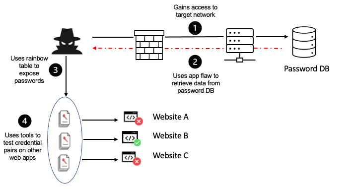
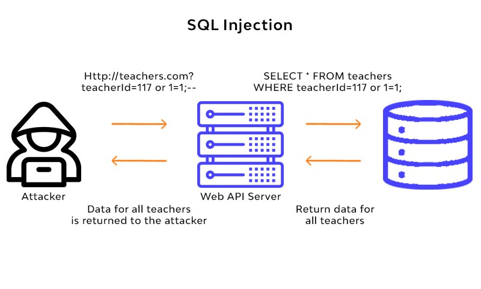
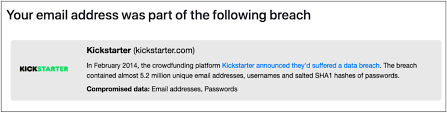
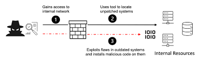
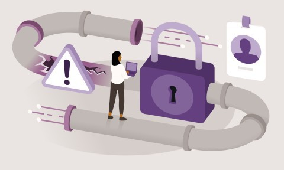

# TryHackMe OWASP TOP 10 - 2021

---

## Task 1 [Introduction]

Task 1 is only an introduction to the top most critical web security vulnerabilities which we can exploit.

It is beginner-friendly.

## Task 2 [Accessing Machines]

**_Connect to our network or deploy the AttackBox._**

Let's connect to our network using **openvpn**

## Task 3 [*1. Broken Access Control*]

**_Read and understand what broken access control is._**

Broken Access Control occurs when an application does not properly enforce **access** controls, allowing unauthorized users to access resources or perform actions that they should not be able to.

This leads to unauthorized access to sensitive data, modification of data, or even execution of arbitrary code.

## Task 4 [Broken Access Control (IDOR Challenge)]

Insecure Direct Object References (IDOR) occurs when an application exposes a reference to an internal implementation object, such as a file, directory, database record, or key.

For example, let's say we're logging into our bank account, and after correctly authenticating ourselves, we get taken to a URL like this https://bank.thm/account?id=123456. On that page, we can see all our important bank details, and a user would do whatever they need to do and move along their way, thinking nothing is wrong.

There is, however, a potentially huge problem here, anyone may be able to change the id parameter to something else like 654321, and if the site is incorrectly configured, then he would have access to someone else's bank information.

### How IDOR works

This vulnerability arises due to a misconfiguration in how user input is handled, allowing attackers to access resources they wouldn't ordinarily be able to access.

IDOR impact the confidentiality, integrity, and availability of an organization's data.

**Confidentiality** is compromised when an attacker gains unauthorized access to sensitive information. **Integrity** can be affected if an attacker modifies data, such as changing passwords or adding unauthorized data. **Availability** can be impacted if an attacker deletes resources they don't have access to.

#### IDOR Attacks

](../assets/img/tryhackme_screenshots/IDOR.png)

1. URL Tampering (changing the value of a parameter in the URL)

2. Body Manipulation (URL tampering, but the attacker modifies values in the body of the document)

3. Cookie or JSON ID Manipulation (change values stored in cookies or JSON objects)

4. Path Traversal (access or manipulate files or folders directly on the server)

**IDOR** can be easily prevented with proper acces control, using indirect object refernces or hashing, and GUIDs.

##### Let us deploy the machine

**Login details**

username: **_noot_**

password: **_test1234_**

The URL contains ?note_id=1 — I wonder what happens if you change the parameter value? I might be able to access another user’s notes.

Just as expected, with **id=0** I retrieve the flag.

## Task 5 [*2. Cryptographic Failures*]

Cryptographic Failures are a significant security concern that can lead to data breaches, identity theft, and other serious problems.

Also called as **sensitive data exposure**. These include use of hard-coded passwords and outdated encryption algorithms or insufficient entropy.

To prevent this, it is best to encrypt sensitive data using TLS or HSTS or a strong cryptographically keyor authenticated encryption. Better to avoid ftp/smtp.

## Task 6 [ Cryptographic Failures (Supporting Material 1) ]

When dealing with flat-file databases, especially in web applications, it's crucial to understand the security implications and best practices to mitigate risks.

Flat-file databases, such as SQLite, offer simplicity and ease of use but require careful consideration of security practices, especially when handling sensitive data.

**Encryption at Rest:** Ensure the SQLite database file is encrypted using tools like SQLCipher to be protected against unauthorized access by encrypting the data stored in the database file.

This balances security and efficiency, making it harder for unauthorized users to access the data even if they gain access to the file.

**Access Control:** Implement robust access control measures to safeguard your SQLite database.

This includes configuring file system permissions to restrict database file access and deploying the virtual machine hosting the SQLite database within a private subnet of a Virtual Private Cloud (VPC).

**Secure Coding Practices:** When integrating SQLite into your application, adhere to secure coding practices.

Use parameterized queries to prevent SQL injection attacks like using placeholders for parameters in your SQL statements, which prevents attackers from injecting malicious code.

**Backup and Disaster Recovery:** Develop a comprehensive backup and disaster recovery strategy for SQLite databases.

This includes automated and encrypted backups, storing backups offsite or in the cloud, implementing a retention policy, documenting the disaster recovery process, regularly testing restores, defining recovery time objectives (RTO), and recovery point objectives (RPO).

**File System and Host Environment Security:** Secure the file system and host environment where the SQLite database is stored ensuring that the operating system and application services that protect the files are secure.

Unlike widely adopted RDBMS solutions, applications that utilize flat files may rely on the application developer(s) to provide these services.

**Auditing and Monitoring:** Consider implementing auditing facilities to track access and changes to the file data helping in monitoring unauthorized access or modifications to the database, allowing for quick response and mitigation of potential security breaches.

**Regular Security Reviews:** The key to effective database security lies in a proactive approach. Regularly review and update your security practices to address emerging threats and vulnerabilities ensuring that your SQLite database remains a secure and reliable component of your software ecosystem.

## Task 7 [ Cryptographic Failures (Supporting Material 2) ]

Cracking password hashes, especially weak MD5 hashes, can be efficiently done using online tools like Crackstation.

Crackstation is highly effective for cracking weak MD5 hashes, it's important to note that more sophisticated hashes may require additional tools or techniques.

Crackstation employs massive pre-computed lookup tables to crack password hashes. These tables map hash values to their corresponding plaintext passwords. Rainbow tables are a space-efficient variant that trades off speed for storage space, making them effective for cracking hashes of a certain length.

Crackstation is a powerful tool for cracking weak MD5 hashes, leveraging pre-computed lookup tables and dictionary attacks to quickly identify plaintext passwords.

## Task 8 [ Cryptographic Failures (Challenge) ]

Start the machine first. Once there go to the log-in page and view the source code. You can view the source code by using the hotkey combo CTRL + U. This will open a separate page.

Have a look around the web app. The developer has left themselves a note indicating that there is sensitive data in a specific directory.

delete login and type /assets/

Download the database (.db) and pull up your command line. Now list everything in the folder using the ls -l.

Next, we need to access the database with SQLite3 using sqlite3 webapp.db followed by .tables which brings up “users” and finally PRAGMA table_info (users)

## Task 9 [*3. Injection*]

Injection flaws, including SQL Injection and Command Injection arise when applications interpret user-controlled input as commands or parameters, allowing attackers to manipulate queries or execute arbitrary commands.

User-controlled input should not be interpreted as queries or commands. So using an allow list to compare input against a list of safe inputs or characters, and stripping input to remove dangerous characters before processing.

To prevent SQL Injection attacks filtering database inputs to detect and filter out malicious code, restricting database code to prevent unintended queries, limiting database access through access control restrictions, keeping applications and databases updated, and monitoring application and database inputs and communications.

## Task 10 [ 3.1 Command Injection ]

We are going to infiltrate the cowsay using Linux commands.

TryHackMe was kind enough to give us a few basic commands:

- whoami
- id
- ifconfig/ip addr
- uname -a
- ps -ef

But we will also be using a few others such as:

- ls
- ls-la
- cat /etc/passwd
- cat /etc/os-release

**What strange text file is in the website's root directory?**

I used the command $(ls) to find any files in the root directory

The results are [css drpepper.txt index.php js]. This leads us to the answer to the first question.

**How many non-root/non-service/non-daemon users are there?**

How do we determine that? We use the command $(cat /etc/passwd) to list the users. Command broken down is [cat] or concatenate the file called [/etc/passwd]

There are no non-root/non-service/non-daemon users (standard users).

**What user is this app running as?**

**What is the user's shell set as?**

Without going in-depth into the command, there are no standard users listed; making the answer “0”. The hint here is sbin, which is short for system binary. sbin is meant for system admins and should not be accessible by standard users. So, seeing /sbin/nologin is an indicator.

Going back to the question about the user name [apache] we can scroll to the bottom and find the user’s [apache] shell [/sbin/nologin].

**What version of Alpine Linux is running?**

It is time to finish this task, by using a command to find the operating system version. The command I used was [$(cat /etc/os-release)] the result was straightforward: 3.16.0.

## Task 11 [*4. Insecure Design*]

Insecure design refers to vulnerabilities that are inherent to the application's architecture, stemming from flawed planning or shortcuts taken during development.

These vulnerabilities often arise from improper threat modeling during the planning phases or shortcuts taken by developers for testing purposes, such as disabling OTP validation in development.

The importance of considering security from the outset, rather than as an afterthought. Secure design involves integrating security considerations into every phase of the development process, from requirements and resource management to secure design and secure development lifecycle practices.

The application is robustly designed and tested to prevent known attack methods, with threat modeling being a critical component of this process. The goal is to create an application that is not only functional but also secure, capable of withstanding various attack vectors and protecting sensitive data and user information.

#### Insecure Password Reset Example [Craft CMS]

The weak password recovery flow in Craft CMS, where the vulnerability allowed an attacker to reset the password of any user as long as they knew the username.

The root cause was that the password recovery token was not random but an MD5 hash of the user's email address. This made it easy for an attacker to generate a password reset token for any account by knowing the account's email address.

Craft CMS has a relatively small pre-auth attack surface like other content management systems. But the \craft\controllers\ConditionsController class has a beforeAction method that may allow an attacker to create an **arbitrary** object.

Craft CMS and its dependents’ code bases contain several tools that can invoke methods selectively, such as \GuzzleHttp\Psr7\FnStream or including arbitrary files. An attacker may inject some **PHP code** into the Craft CMS’s log file on successful exploitation.

**_Image Source: Qualys Threat Research Unit (TRU)_**

**Try to reset joseph's password. Keep in mind the method used by the site to validate if you are indeed joseph.**

Navigate to http://MACHINE_IP:85 and get into joseph’s account. Once you get to the page you should notice that it is a login page. We want to use the information that we have so far.

THM provided that the person’s name is ‘joseph”, but we don’t have a password and we are not sure if that is his username. But there is a button that says “I forgot my password…” Click it and continue on.

It first asks the user name, “joseph” was supplied, so we are using that. Now, the question’s hint asks which is the easiest to guess from the three options. The first is an impossible task within the scope of this task and so is the last question. So we are going to be guessing colors. ROYGBIV is a safe place to start.

I tried starting at the spelling variation of Red and finally Bingo! at “green” (it is case-sensitive). The system automatically generates a new temp password.

Open Flag.txt to get the flag and to finish the task.

I try to reset joseph’s password.

## Task 12 [*5. Security Misconfiguration*]

Security Misconfigurations are a significant risk because they occur when security measures that could have been correctly implemented are not. This can happen due to a variety of reasons, including the use of default settings, enabling unnecessary features, leaving default accounts with unchanged passwords, and not using HTTP security headers.

These misconfigurations can lead to default credentials, XML External Entities (XXE), or command injection on admin pages. The exposure of debugging interfaces in production software is another common security misconfiguration, highlighting the need for developers to disable debugging features before deploying applications to production.

#### Debugging Interfaces

The data breach that occurred at the **_crowdfunding platform, Kickstarter, in 2016._**

Approximately 15 million user records were exposed, including names, email addresses, and hashed passwords. The breach was attributed to a vulnerability in the Kickstarter API, which was not properly secured. This vulnerability allowed unauthorized access to user data, leading to a significant security incident.

Time to boot up the machine again.

Once we use the code it will return the database directory.

**What is the database file name (the one with the .db extension) in the current directory?**

The easiest way to figure out the answer is to look for the file name ending in [.db].

**Modify the code to read the contents of the app.py file, which contains the application's source code. What is the value of the secret_flag variable in the source code?**

read the contents of the app.py

**import os; print(os.popen("cat app.py").read())**

## Task 13 [*6. Vulnerable and Outdated Components*]

Refers to the use of open-source or proprietary code that contains software vulnerabilities or is no longer maintained including libraries, frameworks, or other components used in web applications, such as Laravel (PHP), Angular (JavaScript), and Django (Python).

The risk is that they can be exploited by attackers to gain unauthorized access to a web application or its data, leading to security problems like data breaches, financial losses, and reputational damage.

The issue arises when developers are not aware of the latest security vulnerabilities, do not have the resources or tools to keep their components up to date, or lack good documentation of their software dependencies. This can result in complacency and a lack of attention to security risks.

#### Joomla 3.4.3

The unauthenticated remote code execution (RCE) vulnerability in Joomla 3.4.3, which was discovered in 2015. This vulnerability was found in the PHPMailer library used by Joomla, allowing attackers to execute arbitrary code on the server hosting the Joomla site. The issue was due to the PHPMailer library not properly handling the "From" header in emails, which could be manipulated by an attacker to execute arbitrary code.

The ease with which this vulnerability can be exploited, coupled with the fact that it's relatively straightforward to occur, exacerbates the risk. If a company fails to address this vulnerability, it could be left vulnerable to a wide array of attacks, including data breaches, website defacement, service disruptions, malware distribution, and SEO manipulation.

The situation is further complicated by the fact that a single missed update or failure to apply a security patch can leave a Joomla site open to such attacks.

## Task 14 [ Vulnerable and Outdated Components - Exploit ]

In the case of the Nostromo 1.9.6 exploit, a simple fix was needed, demonstrating the importance of being able to adapt and troubleshoot exploit scripts. Exploit scripts typically provide guidance on the arguments needed to execute the exploit, which is a helpful feature for users who may not be familiar with the exploit's inner workings.

The process of finding and exploiting known vulnerabilities can vary. Sometimes, identifying the version number is straightforward, but other times, it may require analyzing the HTML source or even guessing the correct exploit script. However, if a vulnerability is known, there is often a way to determine the application's version, making the discovery process more manageable.

## Task 15 [ Vulnerable and Outdated Components — Lab ]

This task is about exploiting outdated components. Open Firefox then head to the given site. Looking at the site we learn that this is a bookstore app. Go to the Exploit database site and search for the keywords “bookstore”.

**_image source from https://infosecwriteups.com/owasp-top-10-2021-tryhackme-writeup-walkthrough-by-md-amiruddin-913e477c0ea1_**

Download the exploit [47887.py] and use the command:

python3 47887.py [insert URL] and type “y” to launch the shell. Use the command [cat /opt/flag.txt] to reveal the flag. The key to this is you already know what file you are looking for /opt/flag.txt and we know that to open it we have to use the command [cat].

## Task 16 [*7. Identification and Authentication Failures*]

Authentication and session management a help users so they can securely access their accounts and their sessions are properly managed to prevent unauthorized access. However, when these mechanisms are flawed or improperly implemented, they can lead to vulnerabilities that attackers can exploit to gain unauthorized access to user accounts, impersonate users, or hijack sessions resulting in severe security breaches, expose of sensitive user information and potentially leading to financial losses, identity theft, and other malicious activities.

Implement strong password policies, enforce automatic lockouts after a certain number of failed login attempts to prevent brute force attacks, and use multi-factor authentication (MFA) to add an additional layer of security to mitigate these.

Monitoring and auditing web application activity, using logging and alerting tools to detect anomalies, and employing penetration testing and vulnerability scanning tools to identify weaknesses are also essential strategies for preventing broken authentication and session management vulnerabilities.

## Task 17 [ Identification and Authentication Failures Practical ]

Start up the machine and go to given website.

register as the username “darren”, as the instructions say,

Let’s try this again, but instead put a space before like this:

“ darren”

It will register “ darren’ with the same rights as “darren”, but with whatever email and password I entered.

Now, let’s use the same method to access the username “arthur”.

## Task 18 [*8. Software and Data Integrity Failures*]

Integrity refers to the unaltered and uncorrupted state of data and software. It ensures that the data and software have not been tampered with or modified in an unauthorized manner.

To overcome this problem, you will often see a hash sent alongside the file so that you can prove that the file you downloaded kept its integrity and wasn't modified in transit. A hash or digest is simply a number that results from applying a specific algorithm over a piece of data. When reading about hashing algorithms, you will often read about MD5, SHA1, SHA256 or many others available.

#### Software and Data Integrity Failures

This vulnerability arises from code or infrastructure that uses software or data without using any kind of integrity checks. Since no integrity verification is being done, an attacker might modify the software or data passed to the application, resulting in unexpected consequences. There are mainly two types of vulnerabilities in this category:

* Software Integrity Failures
* Data Integrity Failures

## Task 19 [ Software Integrity Failures ]

Consider a scenario where a web application relies on a third-party library hosted on an external server, such as a popular JavaScript library like Bootstrap. The application includes Bootstrap by linking to its CDN (Content Delivery Network) in the HTML code, similar to how jQuery was included:

This approach is convenient as it allows the application to benefit from the latest version of Bootstrap without needing to download and host the library itself. However, it introduces a potential security risk. If an attacker gains access to the Bootstrap official repository, they could modify the contents of https://stackpath.bootstrapcdn.com/bootstrap/4.3.1/css/bootstrap.min.css to inject malicious CSS or JavaScript code. This would affect all websites that include Bootstrap from this CDN, potentially leading to cross-site scripting (XSS) attacks or other security vulnerabilities.

To mitigate this risk, modern browsers support Subresource Integrity (SRI), a security feature that allows developers to specify a cryptographic hash of the expected resource. The browser will only load the resource if its hash matches the expected value, ensuring that the resource has not been tampered with. This mechanism prevents the execution of modified versions of the library.

The correct way to include Bootstrap with SRI in your HTML code would include an integrity attribute with the hash of the expected resource. For example:

This line ensures that if an attacker modifies the Bootstrap library, browsers will not execute the modified version, thus protecting users from potential security threats. You can generate the necessary hashes for any library using tools like the SRI Hash Generator available at https://www.srihash.org/.

This example illustrates the importance of using SRI to ensure the integrity of third-party resources included in web applications, protecting users from potential security risks associated with the use of external libraries.

---

go to https://www.srihash.org/

Input the given URL [https://code.jquery.com/jquery-1.12.4.min.js] and ensure that you’re using SHA-254.

## Task 20 [Data Integrity Failures]

log into the guest account with a random password.

Once logged in it gives you another message.

Press SHIFT+F12 to bring up the Developer Tools

Once you open the Dev Tools go to the Storage tab.

***(answer to question 1)***

DECODE the header and payload separately.

Copy and paste the decoded information and change the “HS256” to “none” in the header, then change “guest” to “admin”. Now its time to encode this information. Take the result of the two codes and combine them. 

Copy and paste the pair into the value of the cookie.

Insert the code into the cookie, refresh the page to get the flag.

***(answer to question 3)***

**Try logging into the application as guest. What is guest's account password?**

log in with a random password and it gives the passwrod itself

## Task 21 [*9. Security Logging and Monitoring Failures*]

***(answer to question 1)***

There is IP address that reoccurs in the span of 15 seconds and is the attack. 

The next thing to notice is the different attempts. Same IP address, different login names, in 15 seconds. This is the key to question two. It is a “Brute Force” attack.(answer to question 2)

***(fortinet's definition)***

## Task 22 [*10. Server-Side Request Forgery (SSRF)*]

SSRF **exploits** the trust that a server places in its own requests, allowing attackers to bypass security measures and access protected resources. 

SSRF **attacks** can target internal network services, cloud service metadata endpoints, file systems, and databases, potentially leading to data leakage, unauthorized access, or even Remote Code Execution (RCE).

Start machine and open link given.

The first question asks for the host that is allowed in the Admin Area. to find this answer we need to navigate to that page. Look for the three bars in the upper right and click on it.

Now attempt to open the Admin Area.

Once I attempt, I will be given a message that you were denied access, because I am not the “localhost”. This is the answer to the first question.

The next question asks for the server parameter for the resume download. Go back to the home page and inspect.

**secure-file-storgage.com** is the answer that we are looking for.

The next question asks us to intercept the request via SSRF.

The next step is to remove and replace it with the IP of our attack box.

### EXTRA CREDIT

We are going to work on the server’s link to get into the Admin Area.

We already know from the first question that only “localhost” has access to the area. So we are going to change the server to the localhost and admin by using “server=http://localhost:8087/admin#&id=75482342”.

The link works still, so we need to break up id. But, if you drop the “id=75482342” the link will not work. So, we have to keep the link intact while breaking the server from the id. I had to do a lot of digging for this.

I figured out that we can use a method similar to SQL injection to break up the server and id in the link (obfuscation). Some forums called it “escaping the # (hash)”. 

http://10.10.122.224:8087/server=http://localhost:8087/admin%23&id=75482342

We should get the flag and feel a sense of accomplishment, because we completed an optional task that required research and persistence.

## Task 23 [What’s Next]

Mark as Completed

Room is finished.