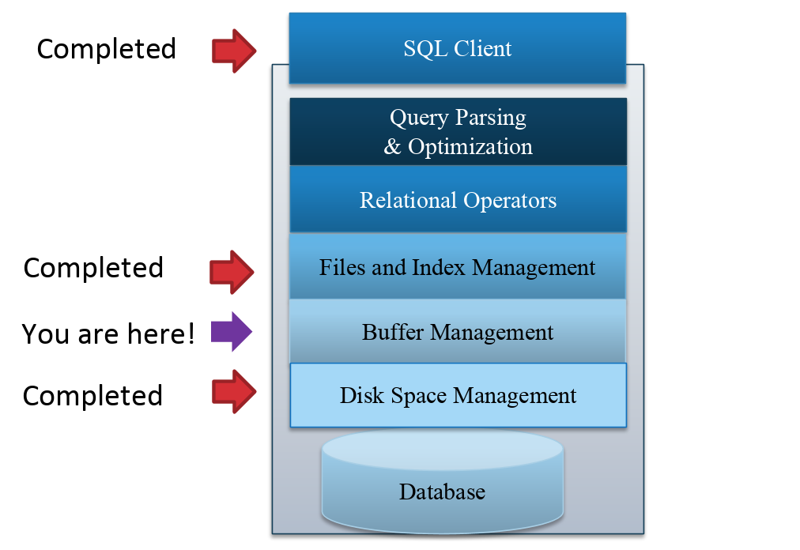
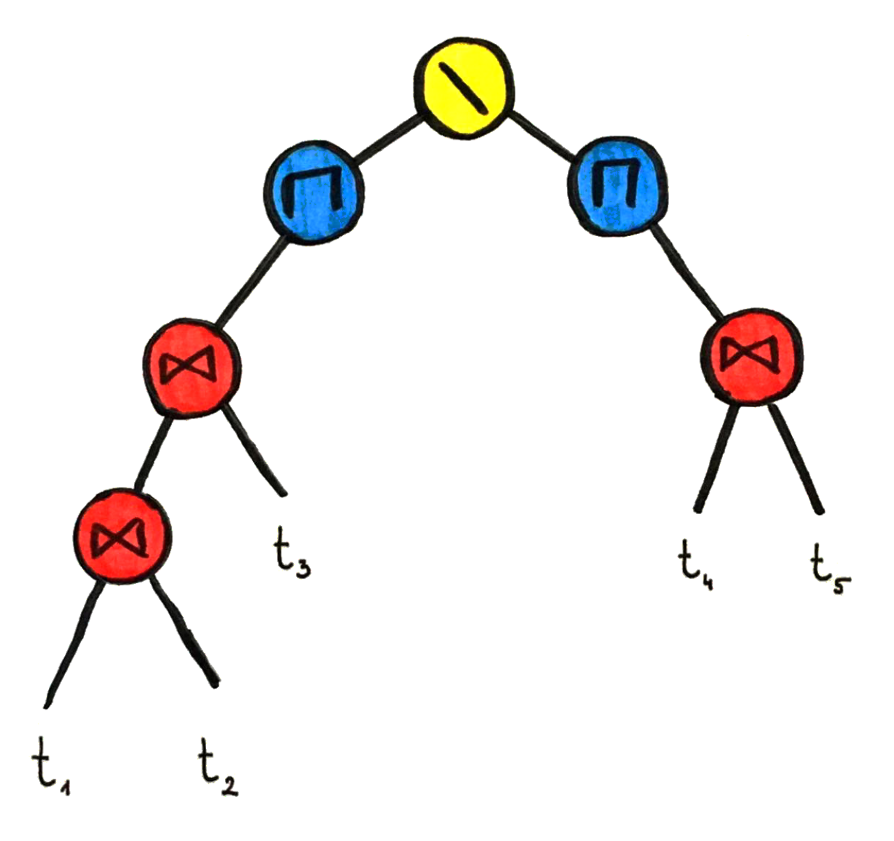

# Topic : Database storage structures and building RDBMS from scratch

For this vlog, I have done it based on a practical under the same topic. A conducted practical on storage and buffer management presents these foundational principles in designing and implementing efficient and reliable systems.

## What I Learned 

### Storage and Buffer Management

#### Disk Block Management

How data is organized and accessed on a disk, which is fundamental for optimizing performance and managing storage space efficiently

#### RAID Levels Simulation

For designing systems that require high availability and fault tolerance. By understanding how data is striped, mirrored, or parity-protected across multiple disks, I can make informed decisions about the RAID level that best suits the needs of a particular application

#### Buffer Pool Management

impacts query performance and system responsiveness

how to efficiently manage memory, including how to fetch and evict pages based on usage patterns

---

I realize the importance of considering data storage and management strategies early in the design phase of any system. It's not just about choosing the right technology or implementing a specific feature; it's about understanding the underlying principles that drive these choices. This understanding allows me to make more informed decisions, optimize system performance, and ensure the **reliability** and **scalability** of the systems I develop.

In conclusion, learning about disk block management, RAID levels, and buffer pool management has provided me with a solid foundation in data storage and management principles. It has equipped me with the knowledge to design and implement systems that are not only efficient but also robust and scalable. 

This knowledge is invaluable in the field of software engineering, where the ability to manage and optimize data storage is a key skill.

## What I Did

After a short analyzing and studying under Data Storage Structures, I go to proceed on researching on **how** building an RDBMS is possible and **what** makes it possible.

#### start up

Building a relational database from scratch is a complex process that requires careful planning and implementation of various procedures and data structures. Each step is crucial for ensuring the database's functionality, performance, and security. 

The process starts with designing the database schema, followed by creating tables and indexes, managing transactions, optimizing queries, and finally implementing security measures. Understanding these procedures and the importance of each step is essential to design and implement a robust and efficient relational database. 

This knowledge not only enhances the engineer's technical skills but also their ability to make informed decisions about database design and optimization.

## Conclusion

Building a relational database from scratch involves a series of critical steps, including understanding requirements, creating an Entity Relationship Diagram (ERD), designing the database schema, implementing the database, populating it with data, and querying and managing the database. 

The use of specific data structures, such as tables, primary keys, foreign keys, indexes, constraints, views, stored procedures, and triggers, is essential for ensuring the database is efficient, reliable, and maintainable. Each of these steps and data structures plays a vital role in the design and operation of a relational database, emphasizing the importance of data integrity, query performance, and data management.

